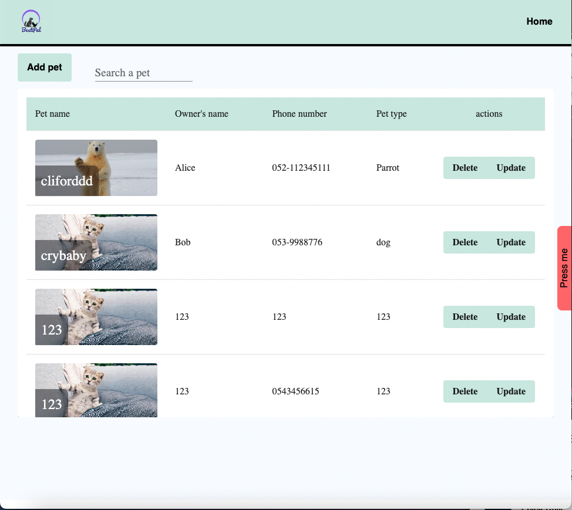

# Pet Clinic

This is a [Next.js](https://nextjs.org/) project bootstrapped with [`create-next-app`](https://github.com/vercel/next.js/tree/canary/packages/create-next-app).

Hi there, My name is Eytan and this is my "Pet Clinic" app. hope you enjoy!

In this app you'll have control over adding,deleting and editing pets, all through a single page application.

Libraries used for the frontend  this project are:Axios, React-query,Materiel ui

This project is based on A Nextjs and Tailwind framework, and written in Typescript

